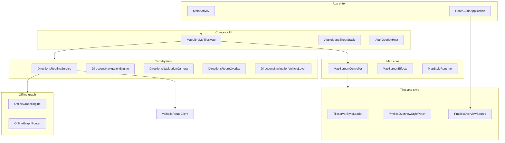
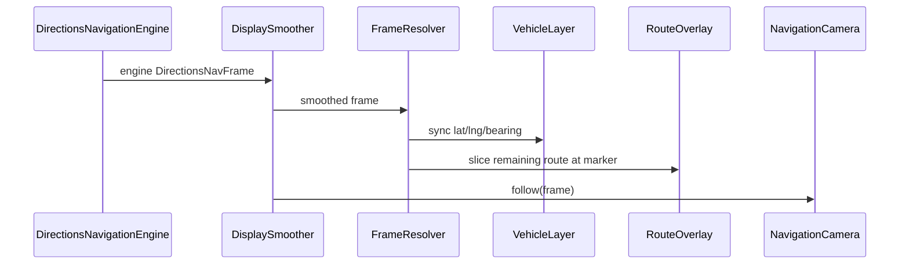

# Road Guide (Kotlin) — Functions & Roles Reference

This document describes the **road-guide-kotlin** Android app: what each major module does, how packages relate, and the main functions/APIs. It reflects the codebase under `app/src/main/java/com/example/roadguideapp/`.

For build, tileserver, and Headway setup, see [README.md](README.md).

---

## 1. Project overview

| Item | Description |
|------|-------------|
| **App ID** | `com.example.roadguideapp` |
| **UI** | Jetpack Compose |
| **Map** | MapLibre Native (vector tiles, 3D buildings, custom layers) |
| **Tiles** | Headway tileserver (Martin) + bundled `GreaterLondon.pmtiles` overview |
| **Routing** | Offline GraphHopper graph → Headway Valhalla HTTP → straight-line preview |
| **Search** | Pelias (autocomplete, nearby, reverse) |
| **Auth** | Offline-first credentials + optional backend session |

### High-level architecture

---

## 2. App entry & application bootstrap

| File | Role | Main functions |
|------|------|----------------|
| `MainActivity.kt` | Single-activity host; enables edge-to-edge and shows the map composable. | `onCreate()` → `MapLibreMbTilesMap()` |
| `RoadGuideApplication.kt` | Global init before any map screen. | `onCreate()` — `MapLibre.getInstance`, `MapLibreTileHttpConfigurator.install`, `PmtilesOverviewSource.prepareAsync`, background asset pack materialization |
| `ui/theme/Theme.kt` | Material 3 theme wrapper. | `RoadGuideAppTheme()` |

---

## 3. Package: `map` (103 Kotlin files)

The map package is the largest area: MapLibre integration, Apple Maps–style sheets, directions, search, POIs, and overlays. Almost all symbols are `internal`; the main **public** entry is `MapLibreMbTilesMap`.

### 3.1 Map core & orchestration

| File | Role | Key functions / types |
|------|------|------------------------|
| **`MapLibreMbTilesMap.kt`** | Root composable: `MapView`, sheet stack, routing UI, navigation session, offline graph import UI, map chrome (compass, scale, zoom/tilt pills in nav). | `MapLibreMbTilesMap()`, `startNavigationSession()`, `endNavigationSession()`, `currentNavFrame()`, `refreshNavCamera()`, `persistGraphUri()`, `runOfflineGraphImport()` |
| **`MapScreenController.kt`** | Central state for search, nearby browse, place selection, sheet snaps, style variant, Look Around target. | `onSearchQueryChanged()`, `enterSearchMode()`, `exitSearchMode()`, `focusSearchResult()`, `focusPlaceOnMap()`, `onMapPlaceTapped()`, `startNearbyCategoryBrowse()`, `fitCameraToNearbyResults()`, `updateNearbyFilter()`, `onMapStyleVariantSelected()`, `lookAroundTarget()` |
| **`MapScreenEffects.kt`** | `LaunchedEffect` wiring: style load, autocomplete, nearby camera fit, POI overlays. | `MapStyleLoadEffect()`, `MapSearchAutocompleteEffect()`, `MapNearbyCameraFitEffect()`, `MapNearbyHighlightsEffect()`, `MapPlaceSelectionOverlayEffect()` |
| **`MapConstants.kt`** | Zoom limits, debounce, padding, animation constants. | Constants only |
| **`MapServerConfig.kt`** | BuildConfig URLs (tileserver, Valhalla, Pelias, map API) and optional Gradle bounds. | `tileserverBaseUrl`, `valhallaBaseUrl`, `tileserverStyleUrl()`, `initialMapFitBounds()`, `mapAreamapBaseUrls()` |
| **`MapInitialViewportResolver.kt`** | Builds initial camera from areamap TileJSON, Gradle bounds, or style metadata. | `merge()`, `fromAreamap()`, `fromGradleBounds()`, `parseTileJsonText()` |
| **`MapViewportFit.kt`** | Applies initial camera and animates to bounds. | `scheduleInitialCamera()`, `animateToBounds()` |
| **`MapViewportBounds.kt`** | Reads visible map bounds and center. | `center()`, `visibleBounds()`, `expand()` |
| **`MapOverviewDefaults.kt`** | Fallback Greater London bounds when no server metadata. | `FIT_BOUNDS`, `CENTER`, `DEFAULT_ZOOM` |
| **`MapAndroidLocation.kt`** | Device location permission and last known position. | `hasCoarseLocationPermission()`, `getLastKnownLatLng()` |
| **`MapRenderSupport.kt`** | Emulator/GPU safety for 3D buildings and tilt. | `safeToShowFillExtrusionBuildings()`, `safeToUse3dCameraTilt()`, `isLikelyAndroidEmulator()` |
| **`MapAppearance.kt`** | Day/night map appearance from clock or user setting. | `resolveMapTimeOfDay()`, `MapTimeOfDay.isDarkAppearance()` |
| **`MapDataTierLogger.kt`** | Debug: which tile tier (overview PMTiles vs detail tileserver) is active. | `logZoomTierIfChanged()`, `resolveTier()` |
| **`MapScaleRuler.kt`** | On-map scale bar. | `MapScaleRulerCalculator.calculate()`, `MapScaleRuler()` |
| **`MapCircleControlButton.kt`** | Floating map controls (circle, zoom pill, tilt pill). | `MapCircleControlButton()`, `MapZoomPillControl()`, `MapTiltPillControl()`, `MapVerticalPillControl()` |
| **`MapLayersSettingsButton.kt`** | Entry to layers / map settings. | `MapLayersMapSettingsButton()` |
| **`MapSettingsSheetContent.kt`** | Settings sheet: appearance, 3D toggle. | `MapSettingsSheetContent()` |

### 3.2 Tiles, style & caching

| File | Role | Key functions |
|------|------|---------------|
| **`TileserverStyleLoader.kt`** | Loads and rewrites MapLibre style JSON (online / disk cache / bundled). | `loadResolvedStyleJson()`, `rewriteStyleUrl()` |
| **`ResolvedMapStyle.kt`** | Loaded style + mode: `Online`, `CachedHybrid`, `BundledOffline`. | Data class |
| **`PmtilesOverviewSource.kt`** | Copies bundled PMTiles to `filesDir`; exposes `pmtiles://file://` URL. | `prepareAsync()`, `awaitReady()`, `resolveUrl()`, `pmtilesFileUrl()` |
| **`PmtilesOverviewStylePatch.kt`** | Dual-tier style: z0–10 overview PMTiles, z11+ tileserver detail. | `applyOnlineDualTier()`, `overviewLayerId()`, `isOverviewLayerId()` |
| **`PmtilesOfflineStyleAdapter.kt`** | Points all sources to offline PMTiles when server is down. | `apply()` |
| **`PmtilesMetadataReader.kt`** | Reads bounds/center/maxzoom from PMTiles header. | `read()`, `parseMetadataJson()` |
| **`OfflineMapStyleBuilder.kt`** | Builds full offline-only style from APK assets. | `build()` |
| **`TileserverReachability.kt`** | One-shot HTTP probe: is tileserver up? | `probeIfNeeded()`, `isReachable()` |
| **`TileserverAreamapInfoLoader.kt`** | Fetches `{tileserver}/areamap` TileJSON for region fit. | `load()`, `parseTileJson()` |
| **`TileserverLocationDiskCache.kt`** | Per-origin disk cache for areamap + resolved style JSON. | `readResolvedStyleJson()`, `writeResolvedStyleJson()`, `readAreamapJson()` |
| **`TileserverBundledResources.kt`** | Sprites/glyphs: APK assets, prefetch, local HTTP bodies. | `prefetchForStyle()`, `applyLocalSpriteAndGlyphs()`, `loadBundledBasicStyleJson()` |
| **`TileserverOfflineCacheInterceptor.kt`** | OkHttp: prefer disk cache when tileserver unreachable. | `intercept()` |
| **`MapLibreTileHttpConfigurator.kt`** | Installs OkHttp stack for MapLibre tile requests. | `install()` |
| **`MapLibreBundledResourceInterceptor.kt`** | Serves bundled sprites/glyphs over HTTP when needed. | `intercept()` |
| **`MapStyleVariant.kt`** | Standard / Hybrid / Satellite; SharedPreferences persistence. | `MapStylePreferences.read()`, `write()` |
| **`MapStyleRuntime.kt`** | Applies time-of-day palette and 3D building/camera behavior on the map. | `applyTimeOfDay()`, `apply3dVisuals()`, `syncBuilding3dVisibility()` |
| **`MapTimeOfDay.kt`** | Dawn / Day / Dusk / Night color palettes. | `fromSystemLocalClock()` |
| **`AppMapStyle.kt`** | Layer/source ID constants from Headway `basic.json`. | Constants (`BUILDING_3D_LAYER_ID`, style paths, …) |
| **`BuildingExtrusion.kt`** | Headway `building_3d` fill-extrusion layer visibility and colors. | `prepareStyle()`, `setBuilding3dVisible()` |

### 3.3 Directions & routing (planning)

| File | Role | Key functions |
|------|------|---------------|
| **`DirectionsRoutingService.kt`** | Plans routes: optimize stops → offline graph → Valhalla → preview polyline. | `planDirectionsRoute()`, `planRoute()`, `hasSavedGraph()`, `awaitOfflineGraphReady()`, `hasOfflineGraph()` |
| **`DirectionsRouteSource`** | Enum: `Preview`, `Valhalla`, `OfflineGraph`, `Unavailable`. | — |
| **`DirectionsStopOptimizer.kt`** | Reorders intermediate stops (nearest-neighbor + 2-opt). | `optimize()` |
| **`DirectionsPathOptimizer.kt`** | Haversine distance, great-circle midpoints, preview polylines. | `buildPolyline()`, `haversineMeters()`, `nearestNeighborStops()` |
| **`DirectionsRouteResult.kt`** | Route DTO: geometry, legs, duration, length. | `DirectionsRouteResult`, `DirectionsRouteLeg` |
| **`DirectionsTravelMode.kt`** | Drive / Walk / Bicycle → Valhalla costing. | `fromChipIndex()`, `chipIndex()` |
| **`ValhallaRouteClient.kt`** | HTTP client for `GET /route?json=…`. | `fetchRoute()` |
| **`ValhallaPolylineDecoder.kt`** | Decodes Valhalla precision-6 encoded polylines. | `decode()` |
| **`ValhallaReachability.kt`** | Probes whether Valhalla endpoint responds. | `probeIfNeeded()`, `isReachable()` |

### 3.4 Turn-by-turn navigation (active guidance)

Navigation runs inside `MapLibreMbTilesMap` when the user starts guidance on a planned route.

| File | Role | Key functions |
|------|------|---------------|
| **`DirectionsNavigationEngine.kt`** | Simulates progress along densified route geometry via `Choreographer` (60 fps). | `loadGeometry()`, `start()`, `stop()`, `currentDistanceM()`, `progress()` |
| **`DirectionsNavFrame`** | One navigation tick: lat, lng, bearing, engine distance, route slice distance. | Data class |
| **`DirectionsNavigationDisplaySmoother.kt`** | Time-based smoothing along arc length + look-ahead bearing (reduces max-zoom jitter). | `reset()`, `clear()`, `smooth()` |
| **`DirectionsNavigationFrameResolver.kt`** | Keeps marker and remaining-route line on the same polyline point. | `resolveDisplayFrame()`, `syncNavigationVisuals()` |
| **`DirectionsNavConfig.kt`** | Tuning: chase camera, tilt/zoom steps, smoothing time constants, route densify spacing. | `chaseViewport()`, `smoothingAlpha()`, `speedMps()`, `clampNavZoom()` |
| **`DirectionsNavGeo.kt`** | Geo math: bearing, haversine, destination point, angle lerp. | `bearingDegrees()`, `haversineMetersNav()`, `destinationPointNav()`, `lerpAngleDegreesNav()` |
| **`DirectionsRouteGeometry.kt`** | Polyline ops: densify, project, slice, arc-length sample, remaining route at marker. | `densifyForRoadDisplay()`, `sliceRemainingRouteAtMarker()`, `sampleAtDistanceM()`, `bearingAlongRouteM()`, `projectOntoPolyline()` |
| **`DirectionsRouteOverlay.kt`** | MapLibre route line + casing (preview blue/white; nav Sygic-style blue + dark border). | `sync()`, `remove()` |
| **`DirectionsRouteAnimation.kt`** | Animated route reveal when planning (not during active nav). | `animateReveal()`, `easeOutCubic()` |
| **`DirectionsNavigationVehicleLayer.kt`** | MapLibre symbol layer for navigation chevron puck. | `sync()`, `remove()` |
| **`NavigationVehicleIcon.kt`** | Bitmap: white chevron on translucent disk (Sygic-style). | `createBitmap()`, `styleImageId()` |
| **`DirectionsNavigationCamera.kt`** | Chase camera: pitch, zoom, bearing, padding; preserves user pinch zoom. | `enter()`, `exit()`, `follow()`, `adjustTilt()`, `adjustZoom()`, `syncUserZoomFromMap()` |
| **`DirectionsWaypointMarkersOverlay.kt`** | Compose overlay: origin / destination / via badges (screen-space dp). | `DirectionsWaypointMarkersOverlay()` |
| **`OfflineGraphImportProgressOverlay.kt`** | Progress UI while importing offline routing graph. | Composable |

#### Navigation data flow (one frame)

### 3.5 Places, search & business POIs

| File | Role | Key functions |
|------|------|---------------|
| **`PeliasSearchClient.kt`** | Pelias API: autocomplete, search, nearby, reverse. | `autocomplete()`, `search()`, `nearby()`, `reverse()` |
| **`PeliasSearchResult.kt`** | Search hit DTO; GeoJSON parsing. | `toMapPlaceDetail()`, `fromFeature()` |
| **`PeliasSearchResultsList.kt`** | Compose list of search suggestions. | Composable |
| **`MapPlaceDetail`** | Unified place model for sheets and map (in `AppleMapsPlaceDetailSheet.kt`). | `fromRenderedFeatures()`, `fromMapFeature()`, `fallback()` |
| **`PlaceAddressResolver.kt`** | Formats OSM addresses; Pelias reverse enrich. | `formatFromOsmProperties()`, `enrichPlace()` |
| **`PlaceMetadataResolver.kt`** | Locality, hours, open-now from OSM/Pelias. | `fromPeliasProperties()`, `estimateOpenNow()`, `formatHoursSummary()` |
| **`MapPoiSelectionController.kt`** | Vector-tile POI pick, selection halo, search/nearby highlights. | `resolvePick()`, `apply()`, `applySearchPlace()`, `applyNearbyHighlights()` |
| **`NearbyMapPoiQuery.kt`** | Query visible map features by category (tile-based, not text search). | `queryVisibleCategory()`, `resolvePicksForResults()` |
| **`NearbyCategorySearch.kt`** | Category shortcuts and tag matching. | `shortcuts`, `matchesMapFeature()`, `mergeResults()` |
| **`NearbyCategorySearchEngine.kt`** | Viewport index → rank → progressive Pelias expansion. | `search()`, `indexAndRank()` |
| **`NearbyResultsFilter.kt`** | Open now / chain / price filters for nearby list. | `apply()` |
| **`PlaceDetailClient.kt`** | Backend: public business-edited place content. | `fetch()` |
| **`PlacePanoramaClient.kt`** | Approved street-view panoramas API. | `fetchApproved()` |
| **`PlaceClaimEligibility.kt`** | Whether “Claim business” UI should show. | `forMapSymbolPresentation()`, `fromPeliasLayer()` |
| **`PlaceClaimResolver.kt`** | Resolves Claim vs Edit from auth + backend. | `resolve()`, `stableClaimKey()` |
| **`BusinessPoiClient.kt`** | CRUD for owned business POIs and media. | `listMyBusinessPois()`, `updatePoi()`, `uploadMedia()` |
| **`BusinessClaimClient.kt`** | POI resolve, claim status, create claim. | `resolvePoi()`, `createClaimRequest()` |
| **`BusinessDetailEditScreen.kt`** | Edit screen for claimed business. | `BusinessDetailEditScreen()`, `BusinessDetailEditContent()` |
| **`LookAroundModal.kt`** | Street View / panorama preview modal. | `LookAroundModal()` |

### 3.6 UI sheets (Apple Maps–style)

| File | Role | Key functions |
|------|------|---------------|
| **`AppleMapsSheetStackModel.kt`** | Sheet types and stack state machine. | `AppleMapSheet` (Home, PlaceDetail, Directions, AddStop, UserProfile); `AppleMapsSheetStackState.push/pop/...` |
| **`AppleMapsSheetStackLayer.kt`** | Renders one layer in the stacked sheet UI. | `AppleMapsSheetStackLayer()` |
| **`AppleMapsPersistentBottomSheet.kt`** | Draggable persistent bottom sheet host. | Composable |
| **`AppleMapsPersistentSheet.kt`** | Home sheet: search bar, nearby shortcuts, browse. | Home/search/nearby content composables |
| **`AppleMapsSheetHeightState.kt`** | Peek / mid / large heights, drag, snap. | `beginDrag()`, `dragBy()`, `resolveReleaseSnap()` |
| **`AppleMapsSheetHeightHost.kt`** | Animate sheet to snap position. | `animateToSnap()` |
| **`AppleMapsSheetGestures.kt`** | Scroll + height-drag gesture wiring. | `scrollContent()`, `toGestures()` |
| **`AppleMapsSheetChromeGestures.kt`** | Collapse-on-scroll and height drag modifiers. | `appleMapsSheetHeightDrag()`, … |
| **`AppleMapsSheetTheme.kt`** | Sheet chrome colors from `MapTimeOfDay`. | `appleMapsSheetTheme()`, `toPlaceDetailPalette()` |
| **`AppleMapsPlaceDetailSheet.kt`** | Place detail sheet sections and actions. | `AppleMapsPlaceDetailSheetContent()` |
| **`AppleMapsDirectionsSheet.kt`** | Directions panel: stops, travel mode, summary, Start. | `AppleMapsDirectionsPanel()` |
| **`AppleMapsAddStopSheet.kt`** | Add-stop search overlay. | `AppleMapsAddStopPanel()` |
| **`AppleMapsStandaloneModals.kt`** | Choose map, my location, graph import alert, sheet grabber. | `AppleMapsChooseMapModal()`, `AppleMapsMyLocationModal()` |
| **`AppleMapsTopRightChrome.kt`** | Top-right controls (3D, compass area). | `AppleMapsTopRightChrome()` |
| **`AppleMapsCompassControl.kt`** | Bearing compass when map rotated. | `AppleMapsCompassControl()` |
| **`NearbyCategoryResultsSheet.kt`** | Nearby category header, filters, result cards. | `NearbyCategoryResultsContent()` |

### 3.7 Map overlays (Compose + MapLibre layers)

| File | Role |
|------|------|
| **`SearchResultMarkerOverlay.kt`** | Fixed-dp pin for selected Pelias result |
| **`NearbyCategoryMarkersOverlay.kt`** | Fixed-dp category markers; hit testing |
| **`NearbyCategoryMarkerBitmaps.kt`** | Tinted circle+glyph bitmaps for nearby markers |
| **`DirectionsWaypointMarkersOverlay.kt`** | Origin / destination / numbered via markers |
| **`DirectionsRouteOverlay.kt`** | Route polyline on map (see §3.4) |
| **`DirectionsNavigationVehicleLayer.kt`** | Navigation puck on map (see §3.4) |

---

## 4. Package: `offlinegraph` (8 files)

Offline turn-by-turn uses a **GraphHopper** routing graph imported from a ZIP or folder (OpenStreetMap extract).

| File | Role | Key functions |
|------|------|---------------|
| **`OfflineGraphEngine.kt`** | Orchestrates import, load, and readiness; mutex-guarded. | `ensureReady()`, `restoreSavedGraph()`, `importGraphZip()`, `importGraphFolder()`, `hasSavedGraph()` |
| **`OfflineGraphRouter.kt`** | GraphHopper wrapper: load graph, route, road distance. | `loadGraphBlocking()`, `routeBlocking()`, `roadDistanceBlocking()`, `isReady()`, `shutdown()` |
| **`OfflineGraphStorage.kt`** | Persists path to active graph on device. | `getActiveGraphPath()`, `saveActiveGraphPath()`, `clearActiveGraph()`, `folderForNewImport()` |
| **`GraphBundleImporter.kt`** | Copies graph ZIP or document-tree folder into app storage. | `copyGraphZip()`, `copyGraphFolderFromTree()`, `isValidGraphCache()` |
| **`OfflineGraphThreadRunner.kt`** | Background work with timeout and error wrapping. | `runBlocking()`, `runBlockingWithTimeout()` |
| **`OfflineGraphMemory.kt`** | Releases heap before large graph load. | `releaseHeapBeforeGraphLoad()` |
| **`OfflineGraphTiming.kt`** | Import/load step timing logs. | `markStart()`, `elapsedMs()`, `logStep()` |
| **`OfflineGraphProgress.kt`** | Progress DTO for UI (phase, percent, detail). | `OfflineGraphProgress`, `CopyProgress` |
| **`OfflineGraphProgressFormatter.kt`** | User-visible progress strings. | `toDisplayString()`, `Throwable.userMessage()` |

**Routing priority** (`DirectionsRoutingService`): if offline graph is loaded → `OfflineGraphRouter.routeBlocking`; else if Valhalla reachable → `ValhallaRouteClient`; else straight-line `DirectionsPathOptimizer.buildPolyline`.

---

## 5. Package: `auth` (18 files)

Offline-first authentication and friends; optional sync with Headway map API when online.

| File | Role | Key functions |
|------|------|---------------|
| **`OfflineAuthStore.kt`** | Local credentials and session (SharedPreferences). | `authenticate()`, `signUp()`, `resetCredentials()`, `endSession()`, `isSessionActive()`, `isBusinessUser()`, `refreshUserFromBackend()` |
| **`OfflineFriendsStore.kt`** | Local friends list cache. | Add/remove/list friends; `FriendError` enum |
| **`AuthOverlayHost.kt`** | Routes auth screens over the map. | `AuthOverlayHost()` |
| **`AuthDestination.kt`** | Navigation targets: SignIn, SignUp, Profile, Friends, QR, … | Enum |
| **`SignInScreen.kt`** / **`SignUpScreen.kt`** / **`ResetCredentialsScreen.kt`** | Auth forms. | Composables |
| **`UserProfileScreen.kt`** / **`UserProfileSheetContent.kt`** | Profile and account sheet. | Composables |
| **`FriendsListScreen.kt`** / **`AddFriendMenuScreen.kt`** / **`AddFriendByIdScreen.kt`** | Friends UI. | Composables |
| **`ScanFriendQrScreen.kt`** / **`MyQrCodeScreen.kt`** | QR add-friend flow. | Composables |
| **`FriendQrPayload.kt`** | Encodes/decodes friend QR JSON. | `encode()`, `decode()` |
| **`QrCodeBitmap.kt`** / **`QrCodeImageDecoder.kt`** | QR generation and gallery decode. | `create()`, `decodeFromUri()` |
| **`FriendsClient.kt`** | HTTP friends API when online. | Backend sync helpers |
| **`AuthUi.kt`** | Shared auth composables and error strings. | `AuthPrimaryButton()`, `AuthField()`, `authErrorMessage()` |

---

## 6. Package: `panorama` (5 files)

360° street-view style viewer (OpenGL).

| File | Role | Key functions |
|------|------|---------------|
| **`PanoramaViewerActivity.kt`** | Full-screen panorama activity launched from Look Around. | Activity lifecycle, intent extras |
| **`PanoramaGLSurfaceView.kt`** | `GLSurfaceView` host for panorama. | Touch/orientation handling |
| **`PanoramaRenderer.kt`** | Draws textured sphere from equirectangular image. | `onSurfaceCreated()`, `onDrawFrame()` |
| **`SphereMesh.kt`** | UV sphere geometry for GL. | Mesh builders |
| **`TextureUtils.kt`** | Loads bitmap into OpenGL texture. | `loadTexture()` |

---

## 7. Tests (`app/src/test`)

| File | Role |
|------|------|
| `auth/OfflineAuthStoreTest.kt` | Unit tests for local auth store |
| `map/PlaceClaimEligibilityTest.kt` | Claim UI eligibility rules |
| `map/PlaceAddressResolverTest.kt` | Address formatting / reverse geocode helpers |

---

## 8. Build configuration (Gradle)

Key `BuildConfig` fields in `app/build.gradle.kts` (see README for values):

| Field | Role |
|-------|------|
| `HEADWAY_TILESERVER_BASE_URL` | Martin / tileserver base (styles, tiles, sprites) |
| `HEADWAY_VALHALLA_BASE_URL` | Valhalla route API via frontend proxy |
| `INITIAL_MAP_MAX_BOUNDS_JSON` | Optional fixed initial bounds |
| `MAP_STYLE_ASSET_RELATIVE_PATH` | Optional bundled offline style JSON |
| `OVERVIEW_PMTILES_MAX_ZOOM` / `DETAIL_TILES_MIN_ZOOM` | Dual-tier zoom crossover |
| `DISABLE_FILL_EXTRUSION_ON_EMULATOR` | Avoid MapLibre SIGSEGV on emulator GLES |

---

## 9. Related repository folders

| Path | Role |
|------|------|
| `e:\Road-Guide\road-guide-kotlin\` | This Android app (documented here) |
| `e:\Road-Guide\Navigation\` | Separate experimental Android nav project (Chaquopy/Python); not merged into kotlin app |
| Project root `GreaterLondon.pmtiles` | Bundled overview tiles copied into APK at build time |

---

## 10. Quick reference — who calls whom

| User action | Primary code path |
|-------------|-------------------|
| Open app | `MainActivity` → `MapLibreMbTilesMap` → `MapStyleLoadEffect` → `TileserverStyleLoader` |
| Search place | `MapScreenController.onSearchQueryChanged` → `PeliasSearchClient.autocomplete` → `SearchResultMarkerOverlay` |
| Plan route | `AppleMapsDirectionsPanel` → `DirectionsRoutingService.planDirectionsRoute` → overlay + waypoint markers |
| Start navigation | `MapLibreMbTilesMap.startNavigationSession` → `DirectionsNavigationEngine` + camera + vehicle layer |
| Pinch zoom in nav | `MapLibreMap` gesture → `DirectionsNavigationCamera.syncUserZoomFromMap` |
| Tilt +/- in nav | `MapTiltPillControl` → `adjustTilt` → `refreshNavCamera` |
| Import offline graph | `runOfflineGraphImport` → `OfflineGraphEngine.importGraphZip` → `OfflineGraphRouter.loadGraphBlocking` |
| Sign in | `AuthOverlayHost` → `OfflineAuthStore.authenticate` |

---

*Generated for the Road Guide Kotlin codebase. Update this file when adding major modules or renaming entry points.*
